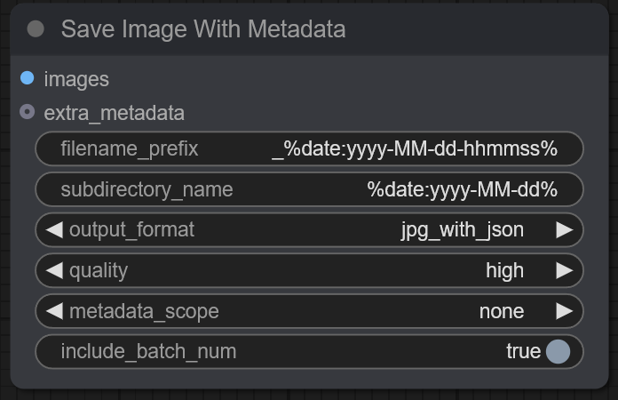
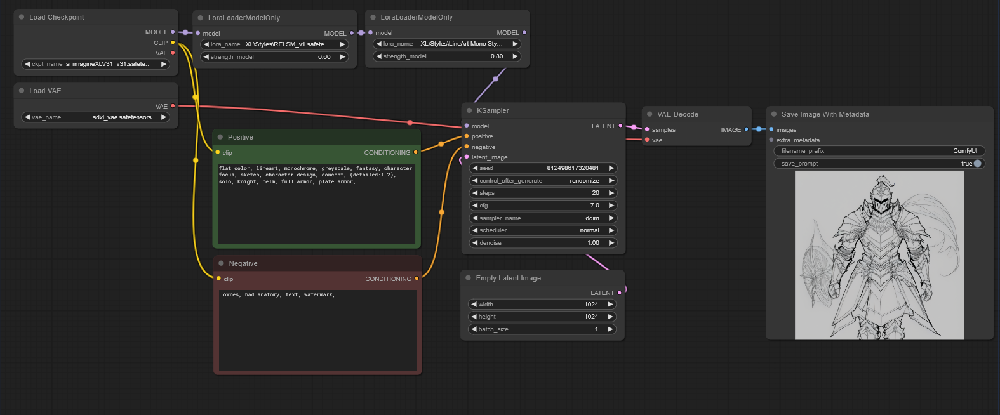
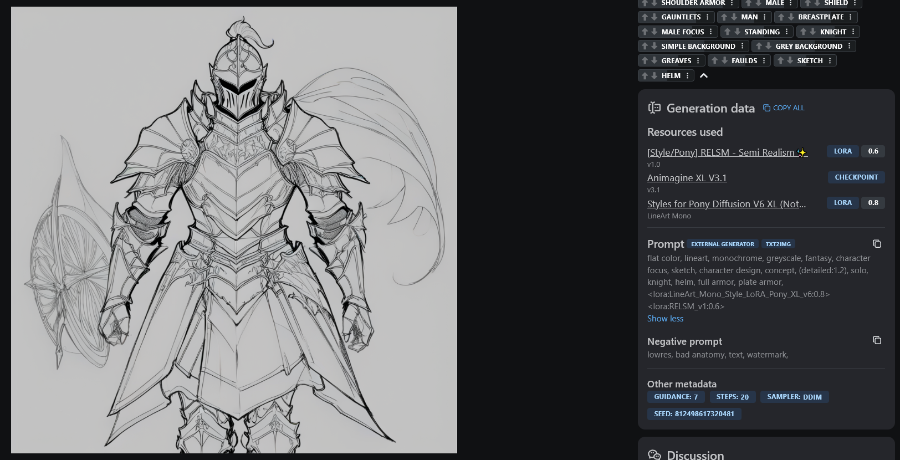

# comfyui-cyberdelia-metadata

Image metadata extension for [ComfyUI](https://github.com/comfyanonymous/ComfyUI). Adds Civitai-compatible metadata to your saved images, with broad third-party node support and robust handling of complex conditioning chains.

By **Cyberdelia AI Lab** · [github.com/cyberdeliaAI](https://github.com/cyberdeliaAI)



---

> **Migration notice**
>
> This is the successor to [`revived_comfyui_image_metadata_extension`](https://github.com/cyberdeliaAI/revived_comfyui_image_metadata_extension). Future development continues here. If you have the old package installed, you can uninstall it and replace it with this one — the node names (`SaveImageWithMetaData`, `CreateExtraMetaData`) are unchanged, so existing workflows will keep working.
>
> See [Attribution](#attribution) for the full fork chain.

## What it does

Drop-in replacement for ComfyUI's default `Save Image` node. Writes structured metadata to PNG, JPG, or WebP files so platforms like Civitai can read back your seed, model, LoRAs, prompts, sampler settings, and more without manual entry.

### Key features

- **Civitai-compatible metadata** in saved images (PNG / JPG / WebP)
- **Automatic LoRA detection** — strengths and hashes are written into prompt metadata
- **Broad third-party support** — out-of-the-box integrations for rgthree, efficiency-nodes, easyuse-nodes, lora-manager, and many more (see [`modules/defs/ext/`](modules/defs/ext/))
- **Smart conditioning chain resolution** — correctly handles `ConditioningZeroOut`, Context Big/Switch (rgthree), and ControlNet apply nodes without crossing positive/negative wires
- **Multi-sampler workflows** — picks the primary generation sampler when both base and upscale passes are present
- **Runtime text capture** — works with dynamic prompt nodes, wildcard expanders, and LLM-based prompt engineers (including [Cyberdelia Z-Engineer](https://github.com/cyberdeliaAI/comfyui-cyberdelia-z-engineer)) that compute their final text at runtime
- **Subdirectory templating** — date masks, model name, prompt prefixes, custom formats
- **Format & quality controls** — PNG, JPG, WebP at adjustable quality, optional sidecar `.json` workflow export

## Installation

### Via ComfyUI-Manager

Search for **`comfyui-cyberdelia-metadata`** or **`Cyberdelia`** and install.

### Manual

```bash
cd ComfyUI/custom_nodes
git clone https://github.com/cyberdeliaAI/comfyui-cyberdelia-metadata.git
```

Restart ComfyUI.

## Usage

Replace your `Save Image` node with **Save Image With MetaData**. Hook up your image input, optionally connect your model/sampler/LoRA chain, and save.



LoRA strings are added to the prompt area automatically so Civitai recognises the weights you used:



A sample workflow is included at [`assets/workflow.json`](assets/workflow.json).

### Node options

- **`filename_prefix`** and **`subdirectory_name`** — both support templating (see below)
- **`output_format`**:
  - `png`, `jpg`, `webp` — saves in the chosen format
  - `png_with_json`, `jpg_with_json`, `webp_with_json` — also writes the workflow JSON next to the image
- **`quality`** — `max` / `lossless WebP` (100%), `high` (80%), `medium` (60%), `low` (30%). Ignored for PNG.
- **`metadata_scope`**:
  - `full` — default metadata plus extras (LoRA, hashes, third-party fields)
  - `default` — same as the stock `SaveImage` node
  - `parameters_only` — A1111-style parameters string only
  - `workflow_only` — workflow JSON only
  - `none` — strip all metadata

### Filename / subdirectory templating

`filename_prefix` and `subdirectory_name` support these mask tokens:

| Token | Replacement |
|-------|-------------|
| `%seed%` | Seed value |
| `%width%` | Image width |
| `%height%` | Image height |
| `%pprompt%` | Positive prompt |
| `%pprompt:[n]%` | First *n* characters of positive prompt |
| `%nprompt%` | Negative prompt |
| `%nprompt:[n]%` | First *n* characters of negative prompt |
| `%model%` | Checkpoint name |
| `%model:[n]%` | First *n* characters of checkpoint name |
| `%date%` | Date in `yyyyMMddhhmmss` |
| `%date:[format]%` | Date in custom format |

Inside `%date:[format]%`:

| Identifier | Description |
|------------|-------------|
| `yyyy` | Year |
| `MM` | Month |
| `dd` | Day |
| `hh` | Hour |
| `mm` | Minute |
| `ss` | Second |

Example: `%date:yyyy-MM%` produces a subdirectory like `2026-05`.

## Runtime text capture (for LLM / dynamic prompt nodes)

This extension supports nodes that compute their final prompt text at runtime — not just nodes that store text in a widget. Any node can register its resolved text by calling:

```python
# Inside your node's main function:
import sys
from comfy_execution.utils import get_executing_context
context = get_executing_context()
if context is not None:
    for mod in sys.modules.values():
        if mod is None:
            continue
        record_fn = getattr(mod, "record_resolved_text", None)
        if callable(record_fn):
            record_fn(context.node_id, final_text, getattr(context, "list_index", None))
```

The walker will pick up the registered text and write it to metadata instead of falling back to the widget value. This is how [Cyberdelia Z-Engineer](https://github.com/cyberdeliaAI/comfyui-cyberdelia-z-engineer) makes its LLM-engineered output appear in saved metadata.

## Supported nodes and extensions

- **Comfy Core**: see [`modules/defs/samplers.py`](modules/defs/samplers.py) and [`modules/defs/captures.py`](modules/defs/captures.py)
- **Third-party**: see [`modules/defs/ext/`](modules/defs/ext/) — each `.py` file there registers a third-party node pack

> [!TIP]
> If the `full` metadata scope errors out, it's usually because a third-party node in your workflow isn't registered. Either swap to a Comfy Core equivalent or add a new file under [`modules/defs/ext/`](modules/defs/ext/) following the existing pattern.

## Attribution

This project is the third link in a fork chain — each maintainer carrying the baton forward when the previous one stepped back:

1. **Original**: [edelvarden/comfyui_image_metadata_extension](https://github.com/edelvarden/comfyui_image_metadata_extension) — the original concept and initial implementation
2. **Revived fork**: [Santodan/revived_comfyui_image_metadata_extension](https://github.com/Santodan/revived_comfyui_image_metadata_extension) — picked up maintenance, added LoRA metadata, subdirectory templating, format/quality options, scope controls
3. **Cyberdelia continuation**: this repo — substantial improvements to the conditioning chain resolution (proper `ConditioningZeroOut` handling, rgthree Context Big/Switch passthrough fixes, ControlNetApply chain following), better multi-sampler workflow support, runtime text capture for non-CLIPTextEncode prompt sources, and ongoing maintenance under the Cyberdelia AI Lab umbrella

Big thanks to **edelvarden** and **Santodan** for the foundation this is built on.

## License

GPL-3.0 — see [LICENSE](LICENSE).

This license is inherited from the original project; it requires that derivative works (including this one) remain GPL-3.0 and preserve the copyright notices of all prior authors.
